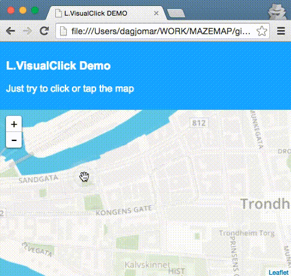

# Leaflet.VisualClick
A plugin that adds visual feedback when user clicks/taps the map. Useful for when you have a delay on the clickEvents for async fetching of data, or implementation of Leaflet.singleclick - or just because it looks great :)




### Install
- `npm install` - This will download dependencies, and run a build upon completion

### Run the demo
- Open up the `demo/demo.html` file in a browser and watch the magic!


### Copy files
After install, files should be generated in the `dist` folder
Copy these files and include them as you normally would

### That's it
- it should work now :)

### Browser compatibility
Uses CSS3 animations, so basically follows this table: http://caniuse.com/#search=animation

Tested in
- Chrome 45 @ OSX
- Safari 8.0.7 @ OSX
- Firefox 41.01 @ OSX
- IE10 @ Windows 8
- IE11 @ Windows 8.1
- Chrome 45 @ iPhone iOS 9
- Safari @ iPhone iOS 9

----

Behaviour is bugged in IE10 due to the lack of `pointer-events: none` in CSS.
This means that the decoration added by this plugin will catch events meant for
whatever overlay might be underneath the clicked point. This is worked around
by using a map pane between the tiles pane and the overlays pane (but
of course this means overlays will overlap the visual click effect).

### Configurations
There are some options you can configure if you really need to.
Here's an example:

```
    map = L.map('map',{
      //visualClick: false, //can be disabled
      //visualClickMode: 'touch', //A default detection is done, but you can override...
      visualClickEvents: 'click contextmenu' //can be multiple space-seperated events, like 'click', 'contextmenu', 'dblclick'...
      //visualClickPane: 'shadowPane'
    });
```

### Developing?
- run `npm start` - this should fire the build process and also start a watcher that re-compiles if you change the source files

